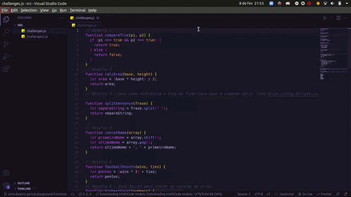

Este projeto contém os requisitos realizados por _[Anna Beatriz Garcia Trajano de Sá](www.linkedin.com/in/anna-beatriz-trajano-de-sá)_ enquanto estudava na [Trybe](https://www.betrybe.com/) :rocket:

# Project Playground Functions

Implementei e desenvolvi funções em JavaScript a partir dos requisitos determinados.

Veja o exemplo a seguir do layout do projeto!

## Demo

## Habilidades Desenvolvidas

Neste projeto, desenvolvi as seguintes habilidades:

- Escrever códigos em JavaScript que usam variáveis e tipos primitivos;
- Utilizar conceitos da linguagem como a tipagem dinâmica e operadores lógicos/aritméticos/de atribuição no seu código;
- Criar códigos que usam estruturas condicionais, como o if/else ;
- Manipular arrays (listas);
- Utilizar o comando for ;
- Quebrar grandes problemas em pequenos;
- Utilizar a lógica de programação na resolução de problemas;
- Manipular objetos;
- Utilizar o comando for/in ;
- Utilizar funções para organizar e estruturar o seu código;

# Escopo do Projeto

    # Requisitos obrigatórios:
    - [x] [1 - Crie uma função usando o operador &&](#1---crie-uma-função-usando-o-operador-)
    - [x] [2 - Crie uma função que calcule a área de um triângulo](#2---crie-uma-função-que-calcule-a-área-de-um-triângulo)
    - [x] [3 - Crie uma função que divida a frase](#3---crie-uma-função-que-divida-a-frase)
    - [x] [4 - Crie uma função que use concatenação de strings](#4---crie-uma-função-que-use-concatenação-de-strings)
    - [x] [5 - Crie uma função que calcule a quantidade de pontos no futebol](#5---crie-uma-função-que-calcule-a-quantidade-de-pontos-no-futebol)
    - [x] [6 - Crie uma função que calcule a repetição do maior número](#6---crie-uma-função-que-calcule-a-repetição-do-maior-número)
    - [x] [7 - Crie uma função de Caça ao rato](#7---crie-uma-função-de-caça-ao-rato)
    - [x] [8 - Crie uma função FizzBuzz](#8---crie-uma-função-fizzbuzz)
    - [x] [9 - Crie uma função que Codifique e Decodifique](#9---crie-uma-função-que-codifique-e-decodifique)
    - [x] [10 - Crie uma função de Lista de tecnologias](#10---crie-uma-função-de-lista-de-tecnologias)

    # Requisitos bônus:
    - [x] [11 - Crie uma função de Número de telefone](#11---crie-uma-função-de-número-de-telefone)
    - [x] [12 - Crie uma função de Condição de existência de um triângulo](#12---crie-uma-função-de-condição-de-existência-de-um-triângulo)
    - [x] [13 - Crie uma função de Boas Vindas ao Bar da Trybe!](#13---crie-uma-função-de-boas-vindas-ao-bar-da-trybe!)

